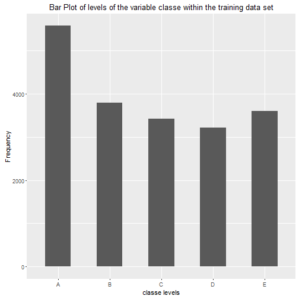
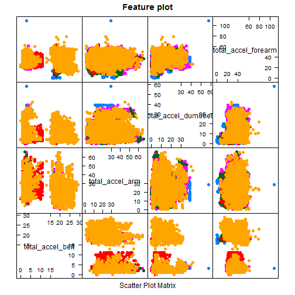

### Synopsis
#### Data Processing
Delete all the irrelevant variables as well as the variables with no non-missing value.

#### Model Construction
Our outcome variable is classe, a factor variable with 5 levels:

  - exactly according to the specification (Class A)
  - throwing the elbows to the front (Class B)
  - lifting the dumbbell only halfway (Class C)
  - lowering the dumbbell only halfway (Class D)
  - throwing the hips to the front (Class E)

Random forest algorithm is known for their ability of detecting the features that are important for classification. Also, the prediction evaluations will be based on maximizing the accuracy and minimizing the out-of-sample error. To that end, Random Forest model is used in this analysis. All available variables after cleaning will be used for prediction.

#### Cross-Validation
Cross-validation will be performed by subsampling our training data set randomly without replacement into 2 subsamples: sub training data (75% of the original training data set) and sub testing data (25%). Our models will be fitted on the sub training data set, and tested on the sub testing data. Once an appropriate model is choosen, it will be tested on the original testing data set.

#### Reproducibility
In order to make the analysis reproducible and the results replicable, the seed is set as 903 in this analysis.

```r
set.seed(903)
```

### Data Analysis
#### Data Processing
Load all the packages required in this analysis including caret and random forest:

```r
# install.packages("caret")
# install.packages("randomForest")
# install.packages("rpart")
# install.packages("lattice")
# install.packages("ggplot2")
library(caret)
library(randomForest)
```

Load the datasets:

```r
# If a value is missing in the dataset, we replace them with NAs.
# Read the testing set
test = read.csv("pml-testing.csv", na.strings = c("NA","#DIV/0!", ""))

# Read the training set
train = read.csv("pml-training.csv", na.strings = c("NA","#DIV/0!", ""))

# Delete columns with all missing values
test = test[ , colSums(is.na(test)) == 0]
train = train[ , colSums(is.na(train)) == 0]

# Also delete irrelevant variables
test = test[ , -c(1:7)]
train = train[ , -c(1:7)]

# Check the size of our datasets
dim(test)
```

```
## [1] 20 53
```

```r
dim(train)
```

```
## [1] 19622    53
```

Take a look at the classe variable distribution in the training dataset.

```r
plot = ggplot(data = train, aes(x = classe))
plot = plot + geom_bar(width = .5)
plot = plot + ggtitle("Bar Plot of levels of the variable classe within the training data set")
plot = plot + xlab("classe levels") + ylab("Frequency")

print(plot)
```



Subsample the training set to do cross-validation analysis. Here we make the sub training sample 75% the size as the original training sample, and the sub testing sample 25% the size as it:

```r
subSamp = createDataPartition(y = train$classe, p = 0.75, list = FALSE)

subTrain = train[subSamp, ] 
subTest = train[-subSamp, ]

dim(subTrain)
```

```
## [1] 14718    53
```

```r
dim(subTest)
```

```
## [1] 4904   53
```

#### Feature Plot

```r
# plot features
total = which(grepl("^total", colnames(train), ignore.case = F))

totalAccel = train[, total]

featurePlot(x = totalAccel, y = train$classe, pch = 19, main = "Feature plot", plot = "pairs")
```



#### Predicting Model
Use random forest model to fit the dataset and use the resulting model to test the sub testing set:

```r
# Build the model
rfModel = randomForest(classe ~. , data = subTrain, method = "class")

# Predict the test data
pred = predict(rfModel, subTest, type = "class")

# Test results on sub testing data set:
confusionMatrix(pred, subTest$classe)
```

```
## Confusion Matrix and Statistics
## 
##           Reference
## Prediction    A    B    C    D    E
##          A 1394    7    0    0    0
##          B    0  941    7    0    0
##          C    0    1  846   11    0
##          D    0    0    2  792    3
##          E    1    0    0    1  898
## 
## Overall Statistics
##                                           
##                Accuracy : 0.9933          
##                  95% CI : (0.9906, 0.9954)
##     No Information Rate : 0.2845          
##     P-Value [Acc > NIR] : < 2.2e-16       
##                                           
##                   Kappa : 0.9915          
##  Mcnemar's Test P-Value : NA              
## 
## Statistics by Class:
## 
##                      Class: A Class: B Class: C Class: D Class: E
## Sensitivity            0.9993   0.9916   0.9895   0.9851   0.9967
## Specificity            0.9980   0.9982   0.9970   0.9988   0.9995
## Pos Pred Value         0.9950   0.9926   0.9860   0.9937   0.9978
## Neg Pred Value         0.9997   0.9980   0.9978   0.9971   0.9993
## Prevalence             0.2845   0.1935   0.1743   0.1639   0.1837
## Detection Rate         0.2843   0.1919   0.1725   0.1615   0.1831
## Detection Prevalence   0.2857   0.1933   0.1750   0.1625   0.1835
## Balanced Accuracy      0.9986   0.9949   0.9933   0.9919   0.9981
```

#### Out-of-Sample Error
Next step is to check much overfitting happens in our model:

```r
# predict on sub testing dataset
predTest = predict(rfModel, subTest)

# true accuracy of the predicted model
accuracy = sum(predTest == subTest$classe)/length(predTest)

# calculate the out-of-sample error
Error = 1 - accuracy
```

Thus our out-of-sample error is

```r
print(Error)
```

```
## [1] 0.006729201
```

#### Results
The random forest model shows a valid model which we choose to use on the test dataset and the cross-validation result shows only a few mossclassification. 

### Prediction on Test Data
predict outcome levels on the original Testing data set using Random Forest algorithm:

```r
predict(rfModel, test, type = "class")
```

```
##  1  2  3  4  5  6  7  8  9 10 11 12 13 14 15 16 17 18 19 20 
##  B  A  B  A  A  E  D  B  A  A  B  C  B  A  E  E  A  B  B  B 
## Levels: A B C D E
```
